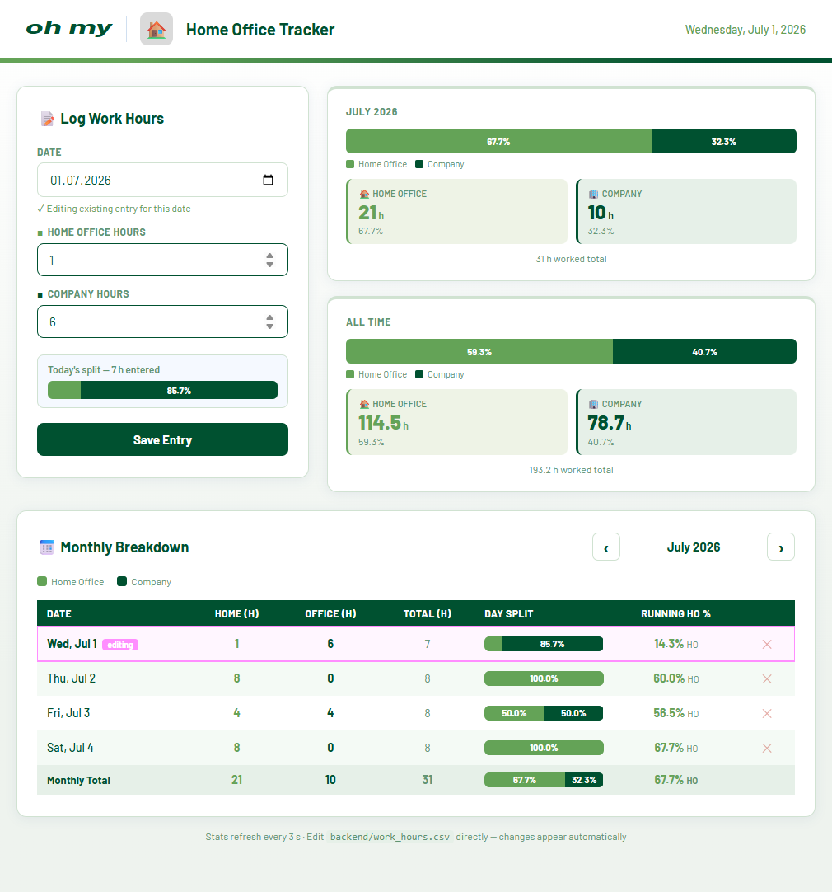

# Oh my 🏠 Home Office Tracker

A lightweight desktop web application for tracking and visualising the ratio
of hours worked **at home** versus hours worked **at the company** — built with
React + FastAPI and packaged as a single Windows executable that requires no
installation.



---

## ✨ Features

- 📝 **Log work hours** for any date via a clean input form
- 📊 **Live ratio bar** — the split updates in real time as you type, before saving
- 📅 **Monthly breakdown table** with per-day split bars and a cumulative
  home-office percentage column
- 🗓️ **Month navigator** to browse any past or future month
- 🔄 **Auto-refresh every 3 seconds** — edit `work_hours.csv` directly in a text
  editor and see the changes appear in the app without reloading the page
- 🗑️ **Delete entries** from the table with two clicks
- 📦 **Single `.exe` for distribution** — end users on Windows need nothing
  installed (no Python, no Node.js)

---

## 🚀 Quick Start (Windows — no installation)

1. Download **`HomeOfficeTracker.exe`** from the [Releases](https://github.com/MMaue/ohmy-HomeOfficeTracker/releases/latest) page.
2. Place it in any folder you like (e.g. `Documents\HomeOfficeTracker\`).
3. Double-click `HomeOfficeTracker.exe`.
4. Your browser opens automatically at `http://localhost:8000`.

> The data file **`work_hours.csv`** is created automatically in the same
> folder as the `.exe` on the first run. It persists between sessions and can
> be edited directly.

---

## 🛠️ Development Setup

Use this workflow if you want to modify the source code or run the app without
building an executable.

### Prerequisites

| Tool | Minimum version | Download |
|------|----------------|---------|
| Python | 3.10 | https://python.org |
| Node.js | 18 LTS | https://nodejs.org |

### Run in development mode

**Windows**
```bat
start.bat
```

**macOS / Linux**
```bash
chmod +x start.sh
./start.sh
```

Both scripts will:
1. Install Python and Node dependencies automatically on the first run.
2. Start the FastAPI backend on **port 8000** and the Vite dev server on **port 5173**.
3. Open `http://localhost:5173` in your default browser.

Press **Ctrl + C** (Linux / macOS) or **any key** in the launcher window
(Windows) to stop all services.

---

## 📦 Building the Windows Executable

Requires **PyInstaller** in addition to the prerequisites above.

```bat
pip install pyinstaller
```

Then run the build script from the project root:

```bat
build.bat
```

The script will:

| Step | Action |
|------|--------|
| 1 | Run `npm run build` to compile the React frontend into `frontend/dist/` |
| 2 | Install Python dependencies via `pip` |
| 3 | Run PyInstaller to bundle everything into a single `.exe` |

The finished executable is placed at:

```
dist/HomeOfficeTracker.exe
```

Copy this single file to any Windows PC and double-click — no runtime
dependencies required.

---

## 🗄️ Data File Format

Hours are stored in a plain CSV file (`work_hours.csv`) next to the executable
(or inside `backend/` during development):

```csv
date,home_hours,company_hours
2024-06-03,4,4
2024-06-04,8,0
2024-06-05,0,8
```

| Column | Format | Description |
|--------|--------|-------------|
| `date` | `YYYY-MM-DD` | ISO 8601 date |
| `home_hours` | decimal | Hours worked from home |
| `company_hours` | decimal | Hours worked at the company office |

The app polls this file every **3 seconds**, so any manual edits appear
automatically without reloading the page.

---

## ⚙️ API Reference

The backend exposes a small REST API on **port 8000**:

| Method | Endpoint | Description |
|--------|----------|-------------|
| `GET` | `/api/entries` | Return all entries sorted by date |
| `POST` | `/api/entries` | Create or update an entry for a given date |
| `DELETE` | `/api/entries/{date}` | Delete the entry for the given date |
| `GET` | `/api/health` | Health check — returns `{"status":"ok"}` |

---

## 🔧 Tech Stack

| Layer | Technology |
|-------|-----------|
| Frontend | [React 18.2.0](https://react.dev/) + [Vite 8.1.0](https://vitejs.dev/) |
| Backend | [FastAPI](https://fastapi.tiangolo.com/) + [Uvicorn](https://uvicorn.dev/) |
| Data storage | Plain CSV (no database required) |
| Fonts | [Barlow](https://fonts.google.com/specimen/Barlow) (Google Fonts) |
| Packaging | [PyInstaller](https://pyinstaller.org/) |

---

## 📋 Requirements

### Python dependencies 

See `backend/requirements.txt`


### Node dependencies 

See `frontend/package.json`

